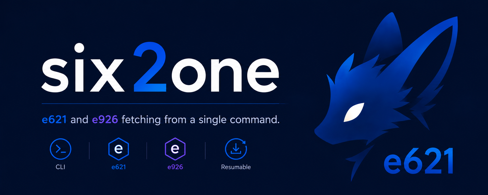

# six2one

<p align="center">
  
</p>

<p align="center">
  <a href="#quick-start">Quick Start</a> •
  <a href="#how-queries-compile">Queries</a> •
  <a href="#the-manifest">Manifest</a> •
  <a href="#commands">Commands</a>
</p>

<p align="center">
  
  <a href="https://github.com/nollafox/six2one/actions/workflows/test.yml">
    
  </a>
  
  
  
</p>

<p align="center">
  <strong>Manifest-backed e621 and e926 fetching from a single command.</strong>
</p>


**six2one** is a small command-line fetcher for e621 and e926. Pass it the same tags you'd type into the site search; it compiles them into a query, downloads matching posts in API-friendly pages, and writes each image alongside a caption file generated from its tags and the raw post JSON. Behind that, a `manifest.json` records everything as it goes so you can resume, dedupe, repair, inspect, and prune without managing state yourself.

The result is a CLI that stays pleasant for one-off searches and trustworthy for long-running collections: reference folders for a particular artist, archives of a saved search, the occasional small dataset.

## Quick Start

Install six2one onto your `PATH` from the project directory:

```bash
python -m pip install --user pipx
python -m pipx ensurepath
pipx install .
```

Fetch your first set:

```bash
621 fox solo --safe
```

That drops into `output/fox-solo-safe/` with this layout:

```
output/fox-solo-safe/
  images/
  captions/
  posts/
  manifest.json
```

Use `--dry-run` to see the compiled query before downloading anything:

```
$ 621 fox solo --safe --dry-run
Compiled query: fox solo rating:s
```

For an editable install without Poetry, use `python -m pip install --user -e .`. If `621` installs but your shell cannot find it, run `python -m site --user-base`; the binary lives under that path's `bin/` directory, or `Scripts\` on Windows.

## How Queries Compile

Tags pass through to e621 unchanged. Artist tags, OR terms, exclusions, and rating get appended in a fixed order, and `--dry-run` shows exactly what comes out:

```
$ 621 fox solo \
    --author some_artist \
    --any cat,dog \
    --exclude chicken,watermark,comic \
    --safe \
    --dry-run
Compiled query: fox solo some_artist ~cat ~dog -chicken -watermark -comic rating:s
```

That compiled string is what you'd type into the e621 search bar, which is also why six2one's parser stays thin. The flags are conveniences for patterns six2one already knows; everything else, including wildcards (`cat*`), single-dash negation (`-comic`), and grouped OR syntax (`( ~cat ~dog )`), passes through to e621's native [search syntax](https://e621.net/help/cheatsheet). Unknown long options stay CLI errors rather than being silently forwarded, but anything that works in the search bar works here:

```bash
621 "( ~cat ~tiger ~leopard ) ( ~dog ~wolf )" --safe
621 fox african_wild_dog -chicken
```

To fetch more than the 320-post default, raise `--limit` or use `--all`. The downloader continues in API-sized pages until it reaches the requested count or the query is exhausted:

```bash
621 fox solo --safe --limit 1000
621 dragon solo --explicit --all --resume
```

## The Manifest

Every output folder gets a `manifest.json` that records what's been downloaded, keyed by numeric post ID, and which queries produced it, keyed by compiled query, site, and image size. That record keeps the folder understandable across sessions: you can stop a fetch, come back later, and continue without reasoning from whatever happens to be on disk.

The same record also controls how six2one handles folders it has already touched. By default, it refuses to fetch into a folder with an existing manifest until you choose the intended mode:

```bash
621 fox solo --safe --resume     # continue the same query
621 fox --any cat,dog --merge    # add a different query to the same folder
621 fox solo --safe --force-new  # start over without deleting files
```

The continuation rules follow from those three modes:

| Situation | Behavior |
|---|---|
| Same query, same output, same size and site, `--resume` | Continue from manifest state. |
| Same query with a higher limit | Continue until the new limit. |
| Same query with a lower limit | Keep existing files; nothing is deleted. |
| Different query in the same output | Fail unless `--merge` or `--force-new` is used. |
| Manifest-listed files are missing | Redownload or regenerate them. |
| Files exist that aren't in the manifest | Ignore them unless `--adopt-existing` is used. |
| Target path collision | Fail unless adoption is explicitly valid. |

Six2one checks the manifest to decide what work still needs doing. If a post is already recorded and its files exist, it skips it; if something should be there but is missing, the next fetch can redownload or regenerate it. You do not edit the manifest directly.

## What's in the Output Folder

The layout is stable:

```
images/      downloaded media
captions/    text caption per post, generated from its tags
posts/       raw post JSON record per post
manifest.json
```

Captions and post JSON are siblings of each image. Those companion files make the folder useful after the download is over: grep for tags, re-derive metadata, rebuild a downstream index, or use `show` to merge the manifest entry, caption text, raw post JSON, and local file paths into one view of a post.

The `--size` flag controls which image variant to fetch, mapping directly to e621 and e926 post fields:

| Size | e621/e926 post field |
|---|---|
| `preview` | `post["preview"]` |
| `sample` | `post["sample"]` (default) |
| `original` | `post["file"]` |

If the chosen URL is missing for a post, six2one records a warning that `--strict` promotes to an error.

## Commands

```
usage: 621 [fetch] [TAGS ...] [options]
       621 show POST_ID... [options]
       621 prune [output_dir]
```

`fetch` is the default subcommand, so `621 fox solo --safe` and `621 fetch fox solo --safe` are equivalent.

### Login

```bash
621 login nollafox YOUR_E621_API_KEY
621 logout
```

`login` writes `.six2one-login.json` next to `pyproject.toml`, and `logout` removes it. The file is gitignored by default. When present, those credentials are used for HTTP Basic auth and a username-specific `User-Agent` on API requests.

That login flow is one part of being a well-behaved e621 client. The other part is pacing: six2one uses an instance-owned rate limiter capped at 2 requests per second, and it pages through search results in chunks of at most 320 posts per API call, which is the e621 post-search maximum. Even `--all` fetches use that same pacing and pagination.

For the safe-only sister site, pass `--site e926` to any fetch or show command, or use the `926` binary, which applies that site default automatically:

```bash
621 fox solo --site e926 --all
926 fox solo --all
926 show 6394158 --fetch  # fetch from e926 if available there
```

### Fetch

```bash
621 [fetch] TAGS... [options]
```

| Option | Meaning |
|---|---|
| `TAGS` | e621 tag query terms. Supports `-tag`, `~tag`, wildcards, and grouped OR syntax. |
| `-o, --out DIR` | Output directory. Default: `./output/<query-slug>`. |
| `-n, --limit N` | Number of posts to fetch. Default: `320`. |
| `--all` | Fetch until the query is exhausted. |
| `--safe` / `--questionable` / `--explicit` | Shortcuts for `--rating`. |
| `--rating RATING` | One of `safe`, `questionable`, `explicit`, `s`, `q`, or `e`. |
| `--author NAME`, `--artist NAME`, `--by NAME` | Add an artist tag. Repeatable. |
| `--any TAG` | Add OR terms as `~TAG`. Repeatable and comma-separated. |
| `-x, --exclude TAG` | Exclude tags as `-TAG`. Repeatable and comma-separated. |
| `--site SITE` | `e621` or `e926`. Default: `e621` for `621`, `e926` for `926`. |
| `--size MODE` | `preview`, `sample`, or `original`. Default: `sample`. |
| `--resume` | Resume from an existing manifest with the same query and output. |
| `--merge` | Merge a different query into an existing manifest. |
| `--force-new` | Replace manifest state for a fresh run while leaving media files alone. |
| `--adopt-existing` | Adopt colliding files only when matching post metadata already exists. |
| `--dry-run` | Print the compiled query and exit. |
| `--validate-tags` | Check concrete and wildcard tags against the tag API before fetching. |
| `--strict` | Treat warnings, including missing file URLs, as errors. |

Hidden compatibility aliases still work: `--continue` for `--resume`, `--or` for `--any`, and `--file` for `--size`.

### Show metadata

```bash
621 show 6394158
621 metadata 6394158
```

`show` searches recursively under `./output` for six2one `manifest.json` files and returns a merged JSON view for matching posts. The `metadata` command is an alias. Each result combines the manifest post entry, `posts/<id>.json` when present, `captions/<id>.txt` when present, and filesystem-derived paths, existence flags, and file sizes.

By default, `show` reads only what is already on disk. Use `--root` to search a narrower folder, `--all` to show every manifest entry under that root, and `--fetch` to fetch remote post JSON only when an ID is missing locally:

```bash
621 show --all --root output/fox-solo-safe
926 show 6394158 --fetch  # fetch from e926 if available there
```

The merged object is filterable with dotted paths. Repeated filters and comma-separated filters are both accepted:

```bash
621 show 6394158 \
  --filter local.image.absolute_path \
  --filter caption.text \
  --filter post.file.url

621 show 6394158 -f local.image.absolute_path,caption.text,post.file.url
```

Filtered keys flatten to their unique leaf names, so `caption.text` becomes `text`. If leaf names collide, six2one keeps enough path context to avoid overwriting values. Without filters, the full merged object is printed.

```bash
621 show 6394158 -f local.image.absolute_path,caption.text,post.file.url --pretty
```

```json
{
  "results": [
    {
      "absolute_path": "/Users/fox/Workspace/nollafox/six2one/output/fox-solo-safe/images/000006394158.jpg",
      "text": "anthro, ascot, belly, belt, big_belly, bottomwear, claws, clothed, clothing, dialogue, error_message, fangs, fur, hair, hand_behind_head, hand_on_belly, inner_ear_fluff, jacket, male, obese, obese_anthro, obese_male, open_mouth, overweight, overweight_anthro, overweight_male, pants, paws, shirt, solo, speech_bubble, standing, standing_on_scale, tail, teeth, text, tongue, topwear, tuft, weighing_scale, canid, canine, fox, mammal, fox_mccloud, nintendo, star_fox, dragontzin, 2026, english_text, hi_res, signature",
      "url": "https://static1.e621.net/data/51/b5/51b5a2f0925e153c2890e37836024f77.jpg"
    }
  ]
}
```

Output modes:

```bash
621 show 6394158 --pretty
621 show 6394158 -f caption.text --raw
621 show --all --root output/fox-solo-safe \
  -f id,local.image.absolute_path,caption.text,post.rating \
  --jsonl
```

That makes it easy to export a local dataset index for scripts, audits, or LoRA training prep.

### Prune

```bash
621 prune [output_dir]
```

Prune scans the output folder for incomplete sibling sets. If an image is deleted by hand but its caption or post JSON remains, `621 prune` removes the orphaned companions and updates the manifest so a later `fetch --resume` can repair the set cleanly. If the output directory does not exist yet, prune creates it and exits.

## Development

Install with Poetry:

```bash
poetry install
```

Run the CLI, the tests, and the compile check from inside the Poetry environment:

```bash
poetry run 621 --help
poetry run 926 fox solo --dry-run
poetry run 621 show --help
poetry run python -m unittest discover -s tests
poetry run python -m compileall -q six2one
```

<br>

***

<p align="center">
  <strong>six2one</strong> - manifest-backed e621 and e926 fetching.
</p>

<p align="center">
  Crafted by <strong>Nolla Fox</strong>
</p>
